# 🤖 JARVIS — AI Evolution Community Assistant

<p align="center">
  
</p>

<p align="center">
  <strong>A local, voice-first desktop AI assistant with a cinematic HUD, memory, skills, MCP tools, model switching, and a dry Stark-style personality.</strong>
</p>

<p align="center">
  <a href="https://aievolutionlabs.io"><strong>🌍 AI Evolution Labs</strong></a> ·
  <a href="https://aievolutionpolska.pl"><strong>🇵🇱 AI Evolution Polska</strong></a>
</p>

<p align="center">
  
  
  
  
</p>

> “Good evening, sir. Systems are standing by; naturally, the interesting bits are already sorted.”

---

## 🇬🇧 English

### ✨ What is JARVIS?

JARVIS is a community-built AI operating layer for your computer. It combines a browser-based cinematic mission-control interface, live speech recognition, text-to-speech, configurable LLM providers, persistent memory, desktop actions, skills, MCP connectors, and developer automation.

The project is built by the **AI Evolution** community for people who want a personal AI assistant that feels useful, fast, elegant, and a little bit funny — not another boring chatbot window.

### 🚀 Highlights

- 🎙️ **Voice-first interaction** — speak commands through the browser and receive spoken replies.
- 🧪 **Voice Capture Lab** — record clean reference voice samples, play them back, save them locally, and use them when creating a custom voice with your provider.
- 🧠 **Switchable AI brain** — Anthropic Claude by default; OpenAI, Google Gemini, DeepSeek, and Ollama are available when configured.
- 🔊 **Premium voice output** — Fish Audio by default, ElevenLabs optional, with configurable voice IDs.
- 🪩 **Cinematic HUD** — reactive Three.js orb, system metrics, activity log, widgets, action guard, and artifacts panel.
- 🧾 **Persistent memory** — stores facts, preferences, tasks, notes, decisions, projects, and people in local SQLite storage.
- ⚡ **Skills system** — bundled skills for productivity, research, business operations, planning, writing, and utility tasks.
- 🔌 **MCP tools** — connect external systems such as GitHub, Slack, Notion, Linear, Sentry, Asana, Atlassian, Zapier, Stripe, HubSpot, Figma, Canva, Supabase, and more.
- 🖥️ **Desktop control** — open apps, websites, files, folders, terminals, screenshots, clipboard, media, volume, and lock screen where supported.
- 🧑‍💻 **Developer automation** — can open Claude Code in project folders, inspect projects, dispatch tasks, and report progress.
- 🛡️ **Action Guard** — sensitive external tool calls can be queued for confirmation before execution.

### 🧬 Personality

JARVIS is tuned to feel like a polished AI operator:

- concise, calm, and capable;
- British-butler inspired, without becoming parody;
- dryly funny, never clownish;
- proactive when useful, quiet when not;
- designed for audio: short phrases, clean cadence, and no corporate filler.

You can tune personality from **Settings → Personality Lab**:

- preset style;
- humor level;
- formality;
- proactive mode;
- custom personality brief;
- response language.

### 🎙️ Voice capture and speech settings

The browser voice loop uses the Web Speech API. For best results, use Chrome or another Chromium-based browser.

In **Settings → Model & Voice → Voice Capture Lab** you can:

1. choose the speech recognition language;
2. record a clean reference sample;
3. play it back immediately;
4. save it locally under `data/voice_samples/`;
5. use the saved sample as source material when configuring or cloning a custom voice in Fish Audio, ElevenLabs, or another voice provider.

Recommended recording phrase:

```text
Good evening. This is my reference voice sample for JARVIS. I am speaking clearly, naturally, and at a normal pace.
```

### 🧩 Supported providers

| Area | Providers |
| --- | --- |
| LLM / reasoning | Anthropic Claude, OpenAI, Google Gemini, DeepSeek, Ollama |
| Text-to-speech | Fish Audio, ElevenLabs |
| Local memory | SQLite |
| Frontend | Vite, TypeScript, Three.js |
| Backend | FastAPI, WebSocket |
| Tooling | MCP connectors, desktop control, Claude Code dispatch |

### 🖥️ Desktop control support

| Capability | macOS | Windows | Linux |
| --- | --- | --- | --- |
| Open app / URL / file | ✅ | ✅ | ✅ |
| Open terminal | ✅ | ✅ | ✅ |
| Set volume | ✅ | graceful fallback | ✅ |
| Media play / pause / next / previous | ✅ | graceful fallback | ✅ |
| Lock screen | ✅ | ✅ | ✅ |
| Clipboard copy | ✅ | ✅ | ✅ |
| Screenshot | ✅ | ✅ | ✅ |
| Apple Calendar / Mail / Notes | ✅ | unavailable message | unavailable message |
| Claude Code terminal dispatch | ✅ | unavailable message | unavailable message |

Unsupported platform features are designed to fail gracefully with a clear JARVIS-style response.

### 📦 Installation

#### 1. Backend

```bash
python -m venv .venv
source .venv/bin/activate  # Windows: .venv\Scripts\activate
python -m pip install -r requirements.txt
```

#### 2. Frontend

```bash
cd frontend
npm install
cd ..
```

#### 3. Environment

Create `.env` in the project root:

```env
ANTHROPIC_API_KEY=your-anthropic-api-key
FISH_API_KEY=your-fish-audio-api-key
FISH_VOICE_ID=612b878b113047d9a770c069c8b4fdfe
ELEVENLABS_API_KEY=
ELEVENLABS_VOICE_ID=
OPENAI_API_KEY=
GOOGLE_API_KEY=
DEEPSEEK_API_KEY=
OLLAMA_BASE_URL=http://localhost:11434
JARVIS_LLM_PROVIDER=anthropic
JARVIS_TTS_PROVIDER=fish_audio
USER_NAME=Tony
HONORIFIC=sir
JARVIS_UI_LANGUAGE=en
JARVIS_RESPONSE_LANGUAGE=en
JARVIS_PERSONALITY_PRESET=stark
JARVIS_HUMOR_LEVEL=balanced
JARVIS_FORMALITY_LEVEL=butler
JARVIS_PROACTIVE_MODE=smart
```

You can also configure providers directly in the app through **Settings**.

### ▶️ Run locally

Terminal 1 — backend:

```bash
python server.py
```

Terminal 2 — frontend:

```bash
cd frontend
npm run dev
```

Open:

```text
http://localhost:5180
```

### ⌨️ Keyboard shortcuts

| Key | Action |
| --- | --- |
| `/` | Focus command bar |
| `M` | Mute / unmute microphone |
| `Esc` | Stop speaking or close panels |
| `L` | Clear activity log |
| `,` | Open settings |
| `?` | Toggle shortcuts overlay |

### 🧱 Architecture

```text
Microphone → Web Speech API → WebSocket → FastAPI → LLM provider → TTS provider → Speaker
                                              │
                                              ├─ Memory / Tasks / Notes
                                              ├─ Skills + executable artifacts
                                              ├─ Control Center widgets
                                              ├─ Action Guard confirmations
                                              ├─ MCP tools
                                              ├─ Desktop / browser / screen context
                                              └─ Claude Code project orchestration
```

### 🔗 Key API endpoints

| Endpoint | Purpose |
| --- | --- |
| `GET /api/health` | Backend health check |
| `GET /api/system` | System metrics |
| `GET /api/usage` | Session token and cost telemetry |
| `POST /api/settings/keys` | Save whitelisted environment keys |
| `POST /api/settings/active` | Select active LLM / TTS provider |
| `GET /api/settings/status` | Full settings status payload |
| `GET /api/skills` | Skill catalog |
| `POST /api/skills/{slug}/toggle` | Enable or disable a skill |
| `POST /api/skills/{slug}/run` | Run executable skill |
| `GET /api/mcp` | MCP connector registry |
| `POST /api/mcp/{id}/connect` | Connect an MCP tool server |
| `GET /api/memories` | Persistent memory list |
| `GET /api/voice-samples` | List local voice reference recordings |
| `POST /api/voice-samples` | Save a browser-recorded voice sample |
| `GET /api/artifacts` | Generated artifacts |
| `GET /api/action-log` | Action Guard audit trail |

The main voice loop runs on:

```text
ws://localhost:8340/ws/voice
```

### ✅ Development checks

```bash
pytest
cd frontend && npm run build
```

### 🛠️ Troubleshooting

- **Microphone does not start** — use Chrome/Chromium, open the app from `http://localhost:5180`, and allow microphone access.
- **No spoken replies** — configure Fish Audio or ElevenLabs. Without TTS, JARVIS still replies in text.
- **Speech recognition language is wrong** — open **Settings → Model & Voice → Voice Capture Lab** and select the correct speech capture language.
- **Voice sample will not save** — keep recordings under 5 MB and use supported browser audio formats such as WebM/Opus.
- **Provider test fails** — verify the API key and selected provider in Settings.
- **Ollama not detected** — confirm `OLLAMA_BASE_URL` and that Ollama is running locally.
- **Platform action unavailable** — some macOS-specific features intentionally return a graceful unavailable message on Windows/Linux.

### 🌍 Community

This project is part of **AI Evolution** — a community building practical AI tools, automations, education, and experiments.

- 🌐 AI Evolution Labs: https://aievolutionlabs.io
- 🇵🇱 AI Evolution Polska: https://aievolutionpolska.pl

---

## 🇵🇱 Polski

### ✨ Czym jest JARVIS?

JARVIS to lokalna, głosowa warstwa AI dla Twojego komputera. Łączy filmowy interfejs mission-control w przeglądarce, rozpoznawanie mowy, syntezę głosu, przełączane modele LLM, trwałą pamięć, akcje desktopowe, umiejętności, konektory MCP i automatyzację pracy deweloperskiej.

Projekt buduje społeczność **AI Evolution** dla osób, które chcą mieć osobistego asystenta AI: użytecznego, szybkiego, eleganckiego i odrobinę zabawnego — a nie kolejne nudne okno czatu.

### 🚀 Najważniejsze funkcje

- 🎙️ **Obsługa głosem** — mówisz do JARVIS-a w przeglądarce i otrzymujesz odpowiedzi głosowe.
- 🧪 **Voice Capture Lab** — nagrywasz czyste próbki głosu, odsłuchujesz je, zapisujesz lokalnie i możesz użyć ich przy tworzeniu własnego głosu u wybranego providera.
- 🧠 **Przełączany mózg AI** — domyślnie Anthropic Claude; opcjonalnie OpenAI, Google Gemini, DeepSeek i Ollama.
- 🔊 **Premium synteza głosu** — domyślnie Fish Audio, opcjonalnie ElevenLabs, z konfigurowalnymi Voice ID.
- 🪩 **Filmowy HUD** — reaktywna kula Three.js, metryki systemu, log aktywności, widgety, Action Guard i panel artefaktów.
- 🧾 **Trwała pamięć** — lokalnie zapisuje fakty, preferencje, zadania, notatki, decyzje, projekty i osoby.
- ⚡ **System umiejętności** — gotowe umiejętności do produktywności, researchu, biznesu, planowania, pisania i narzędziowych zadań.
- 🔌 **Narzędzia MCP** — podłączasz systemy zewnętrzne, np. GitHub, Slack, Notion, Linear, Sentry, Asana, Atlassian, Zapier, Stripe, HubSpot, Figma, Canva, Supabase i więcej.
- 🖥️ **Sterowanie komputerem** — otwieranie aplikacji, stron, plików, folderów, terminala, zrzuty ekranu, schowek, media, głośność i blokada ekranu tam, gdzie system to wspiera.
- 🧑‍💻 **Automatyzacja deweloperska** — może otworzyć Claude Code w projekcie, przejrzeć kod, uruchomić zadania i raportować postęp.
- 🛡️ **Action Guard** — wrażliwe akcje narzędziowe mogą czekać na potwierdzenie przed wykonaniem.

### 🧬 Charakter JARVIS-a

JARVIS jest dopracowany tak, aby brzmiał jak elegancki operator AI:

- zwięzły, spokojny i kompetentny;
- inspirowany brytyjskim stylem lokaja, ale bez parodii;
- zabawny w suchy, inteligentny sposób;
- proaktywny, gdy to pomaga, i cichy, gdy nie trzeba przeszkadzać;
- przygotowany pod głos: krótkie frazy, dobry rytm i brak korporacyjnego lania wody.

Możesz dostroić go w **Settings → Personality Lab**:

- styl osobowości;
- poziom humoru;
- formalność;
- tryb proaktywności;
- własny opis charakteru;
- język odpowiedzi.

### 🎙️ Nagrywanie głosu i ustawienia mowy

Pętla głosowa używa przeglądarkowego Web Speech API. Najlepsze efekty daje Chrome albo inna przeglądarka Chromium.

W **Settings → Model & Voice → Voice Capture Lab** możesz:

1. wybrać język rozpoznawania mowy;
2. nagrać czystą próbkę referencyjną;
3. od razu ją odsłuchać;
4. zapisać lokalnie w `data/voice_samples/`;
5. użyć jej jako materiału źródłowego przy konfiguracji lub klonowaniu głosu w Fish Audio, ElevenLabs albo innym providerze.

Przykładowa fraza do nagrania:

```text
Dobry wieczór. To jest moja referencyjna próbka głosu dla JARVIS-a. Mówię wyraźnie, naturalnie i w normalnym tempie.
```

### 🧩 Obsługiwani providerzy

| Obszar | Providerzy |
| --- | --- |
| LLM / rozumowanie | Anthropic Claude, OpenAI, Google Gemini, DeepSeek, Ollama |
| Text-to-speech | Fish Audio, ElevenLabs |
| Lokalna pamięć | SQLite |
| Frontend | Vite, TypeScript, Three.js |
| Backend | FastAPI, WebSocket |
| Narzędzia | Konektory MCP, sterowanie desktopem, dispatch Claude Code |

### 🖥️ Wsparcie sterowania desktopem

| Funkcja | macOS | Windows | Linux |
| --- | --- | --- | --- |
| Otwieranie aplikacji / URL / plików | ✅ | ✅ | ✅ |
| Otwieranie terminala | ✅ | ✅ | ✅ |
| Głośność systemu | ✅ | łagodny fallback | ✅ |
| Media play / pause / next / previous | ✅ | łagodny fallback | ✅ |
| Blokada ekranu | ✅ | ✅ | ✅ |
| Kopiowanie do schowka | ✅ | ✅ | ✅ |
| Zrzut ekranu | ✅ | ✅ | ✅ |
| Apple Calendar / Mail / Notes | ✅ | komunikat niedostępności | komunikat niedostępności |
| Dispatch Claude Code w terminalu | ✅ | komunikat niedostępności | komunikat niedostępności |

Funkcje niedostępne na danej platformie nie powinny crashować aplikacji — JARVIS odpowie klarownym komunikatem.

### 📦 Instalacja

#### 1. Backend

```bash
python -m venv .venv
source .venv/bin/activate  # Windows: .venv\Scripts\activate
python -m pip install -r requirements.txt
```

#### 2. Frontend

```bash
cd frontend
npm install
cd ..
```

#### 3. Środowisko

Utwórz plik `.env` w katalogu głównym projektu:

```env
ANTHROPIC_API_KEY=twoj-anthropic-api-key
FISH_API_KEY=twoj-fish-audio-api-key
FISH_VOICE_ID=612b878b113047d9a770c069c8b4fdfe
ELEVENLABS_API_KEY=
ELEVENLABS_VOICE_ID=
OPENAI_API_KEY=
GOOGLE_API_KEY=
DEEPSEEK_API_KEY=
OLLAMA_BASE_URL=http://localhost:11434
JARVIS_LLM_PROVIDER=anthropic
JARVIS_TTS_PROVIDER=fish_audio
USER_NAME=Tony
HONORIFIC=sir
JARVIS_UI_LANGUAGE=en
JARVIS_RESPONSE_LANGUAGE=en
JARVIS_PERSONALITY_PRESET=stark
JARVIS_HUMOR_LEVEL=balanced
JARVIS_FORMALITY_LEVEL=butler
JARVIS_PROACTIVE_MODE=smart
```

Providerów możesz też skonfigurować bezpośrednio w aplikacji przez **Settings**.

### ▶️ Uruchomienie lokalne

Terminal 1 — backend:

```bash
python server.py
```

Terminal 2 — frontend:

```bash
cd frontend
npm run dev
```

Otwórz:

```text
http://localhost:5180
```

### ⌨️ Skróty klawiaturowe

| Klawisz | Akcja |
| --- | --- |
| `/` | Fokus na pasek komend |
| `M` | Wycisz / włącz mikrofon |
| `Esc` | Zatrzymaj głos albo zamknij panele |
| `L` | Wyczyść log aktywności |
| `,` | Otwórz ustawienia |
| `?` | Pokaż / ukryj pomoc skrótów |

### 🧱 Architektura

```text
Mikrofon → Web Speech API → WebSocket → FastAPI → provider LLM → provider TTS → Głośnik
                                             │
                                             ├─ Pamięć / Zadania / Notatki
                                             ├─ Umiejętności + artefakty
                                             ├─ Widgety Control Center
                                             ├─ Potwierdzenia Action Guard
                                             ├─ Narzędzia MCP
                                             ├─ Kontekst desktopu / przeglądarki / ekranu
                                             └─ Orkiestracja projektów przez Claude Code
```

### 🔗 Kluczowe endpointy API

| Endpoint | Cel |
| --- | --- |
| `GET /api/health` | Status backendu |
| `GET /api/system` | Metryki systemu |
| `GET /api/usage` | Tokeny i koszt sesji |
| `POST /api/settings/keys` | Zapis dozwolonych kluczy środowiskowych |
| `POST /api/settings/active` | Wybór aktywnego LLM / TTS |
| `GET /api/settings/status` | Pełny status ustawień |
| `GET /api/skills` | Katalog umiejętności |
| `POST /api/skills/{slug}/toggle` | Włączanie / wyłączanie umiejętności |
| `POST /api/skills/{slug}/run` | Uruchomienie wykonywalnej umiejętności |
| `GET /api/mcp` | Rejestr konektorów MCP |
| `POST /api/mcp/{id}/connect` | Podłączenie narzędzia MCP |
| `GET /api/memories` | Lista pamięci |
| `GET /api/voice-samples` | Lista lokalnych nagrań referencyjnych |
| `POST /api/voice-samples` | Zapis próbki głosu nagranej w przeglądarce |
| `GET /api/artifacts` | Wygenerowane artefakty |
| `GET /api/action-log` | Historia Action Guard |

Główna pętla głosowa działa pod adresem:

```text
ws://localhost:8340/ws/voice
```

### ✅ Sprawdzenie projektu

```bash
pytest
cd frontend && npm run build
```

### 🛠️ Rozwiązywanie problemów

- **Mikrofon się nie uruchamia** — użyj Chrome/Chromium, otwórz aplikację z `http://localhost:5180` i pozwól na dostęp do mikrofonu.
- **Brak odpowiedzi głosowych** — skonfiguruj Fish Audio albo ElevenLabs. Bez TTS JARVIS nadal odpowiada tekstowo.
- **Zły język rozpoznawania mowy** — wejdź w **Settings → Model & Voice → Voice Capture Lab** i wybierz poprawny język.
- **Próbka głosu się nie zapisuje** — nagranie musi mieć mniej niż 5 MB i używać wspieranego formatu audio przeglądarki, np. WebM/Opus.
- **Test providera nie przechodzi** — sprawdź klucz API i wybranego providera w Settings.
- **Ollama nie działa** — sprawdź `OLLAMA_BASE_URL` i upewnij się, że Ollama jest uruchomiona lokalnie.
- **Akcja platformowa jest niedostępna** — część funkcji macOS ma celowy, łagodny fallback na Windows/Linux.

### 🌍 Społeczność

Ten projekt jest częścią **AI Evolution** — społeczności budującej praktyczne narzędzia AI, automatyzacje, edukację i eksperymenty.

- 🌐 AI Evolution Labs: https://aievolutionlabs.io
- 🇵🇱 AI Evolution Polska: https://aievolutionpolska.pl
